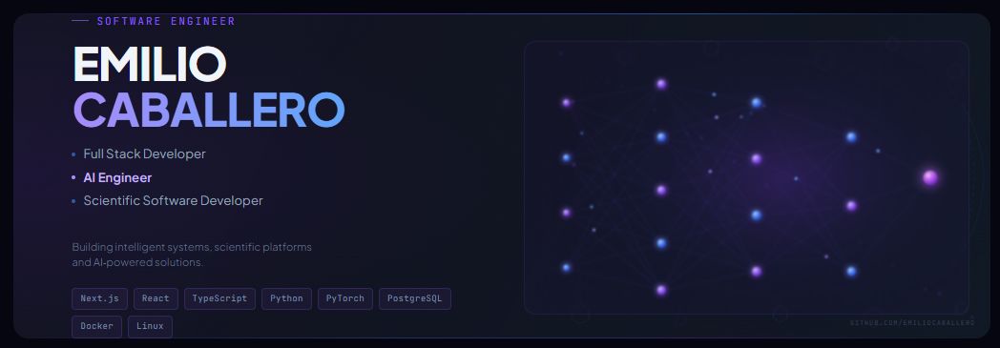

<div align="center">



# Emilio Caballero

### Software Engineer building AI-powered products and modern web platforms.

Building intelligent systems, scientific platforms and AI-powered solutions.

<p>
  <a href="https://github.com/DexenRoss">
    
  </a>

  

  

</p>

</div>

---

# About Me

I'm a Computer Science student focused on building software that solves real-world problems.

My work combines:

- 🧬 Scientific software development
- 🤖 Artificial Intelligence and Deep Learning
- 💻 Full Stack Web Applications
- 🔐 Cybersecurity and Pentesting
- ⚙️ Process Automation

Currently developing platforms and tools that bridge research, automation and modern software engineering.

---

# Current Focus

```txt
🧬 Phaseolus Scientific Platform
🔬 Medical Image Classification
🤖 AI-Powered Automation Systems
🔐 Offensive Security Training
🚀 Fanatic Tech Solutions
